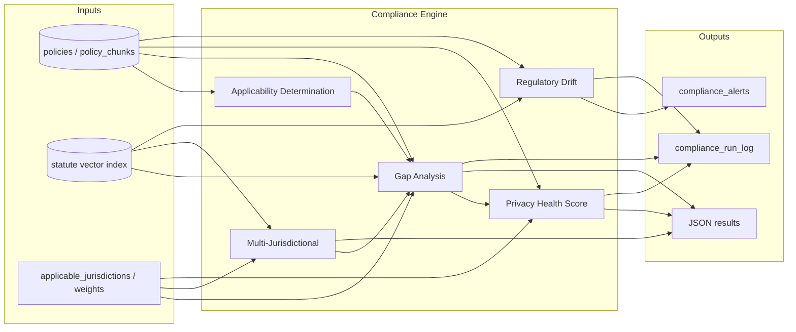

# Automated Compliance Analysis Suite — Functional Specification

## 1. Context and Assumptions

**Existing Privacy Audit Studio infrastructure (from codebase):**

- **Data store**: Database `privacy-compliance` with collections `policies`, `statutes`, `companies`, `policy_chunks`, `statute_chunks`. Policies have `source_url`, `text`, `company_name`, `gathered_at`; statutes have `jurisdiction`, `text`; chunks have `document_id`, `chunk_header_text`, `chunk_text`.
- **Ingestion**: Gather (search) → Crawl (Firecrawl) → Save to collection (policy or statute). Parse-LLM (upstream) + Save-Parsed to produce chunks.
- **Vector index**: [backend/app.py](../backend/app.py) proxies `/api/vector-index` to upstream (source collection → index collection). No vector *search* API is present in this repo; the spec assumes the upstream or a new service provides **vector similarity search** (query embedding → top-k chunks from statute/policy index).
- **SLM**: Fine-tuned on US privacy law; invoked today only via upstream `parse-llm`. All new compliance features must use this SLM and/or deterministic logic only (zero human touch).

**Golden Standard:** The "Golden Standard" is the vector-indexed set of statute chunks (and optionally federal/state policy exemplars) with metadata `jurisdiction` and, when available, statute name/section. Applicable statutes are determined by declared or inferred company footprint (states of operation).

---

## 2. Gap Analysis Engine

### 2.1 Purpose
Compare a company's crawled privacy policy (and its chunked representation) against the Golden Standard of applicable state/federal statutes and output missing disclosures and conflicting statements.

### 2.2 Input Requirements

| Source | Data points |
|--------|-------------|
| Vector store (statute index) | Chunks from `statute_chunks` (or statute index collection) with `jurisdiction`, `chunk_text`, `chunk_header_text`, `document_id`; optional statute/section tags if present. |
| Policy store | One policy document: `document_id`, full `text` or `policy_chunks` for that document (same schema: `chunk_text`, `chunk_header_text`). |
| Configuration / API input | `policy_document_id` (or `company_name` + selection logic); optional `applicable_jurisdictions[]` (e.g. `["CA","VA","CO"]`). If not provided, "all indexed jurisdictions" or a default set. |

### 2.3 Processing Logic

1. **Applicability**: If `applicable_jurisdictions` not provided, optionally call a small SLM step: "Given this policy text, list US states (and federal) for which this policy is likely intended." Output strict list (e.g. state codes). Otherwise use provided list.
2. **Retrieve applicable statute chunks**: For each jurisdiction, retrieve statute chunks (by querying the statute index by jurisdiction filter + optional semantic expansion). Use vector similarity from "disclosure requirement"–style queries (e.g. per category: "right to know", "right to delete", "sale of data", "sensitive data") to get top-k statute chunks per category per jurisdiction.
3. **SLM gap check**: For each (statute_chunk, policy_chunk_set):
   - **Prompt**: Provide statute chunk text + policy full text (or relevant policy chunks). Ask: (a) Is the required disclosure/obligation in the statute chunk addressed in the policy? (b) If yes, quote the policy phrase that addresses it; if no, state "MISSING". (c) Is there any statement in the policy that conflicts with the statute (e.g. "we do not disclose" where statute requires disclosure)? Structured output (JSON): `{ "addressed": boolean, "policy_quote": string | null, "missing": boolean, "conflict": boolean, "conflict_description": string | null }`.
4. **Aggregation**: Collect all (statute_ref, jurisdiction, requirement_summary, addressed, missing, conflict, policy_quote, conflict_description). Deduplicate by (statute_ref, requirement_summary).

### 2.4 Output Format

**Primary:** JSON (for downstream systems and UI).

```json
{
  "policy_document_id": "...",
  "company_name": "...",
  "applicable_jurisdictions": ["CA", "VA"],
  "analyzed_at": "ISO8601",
  "gaps": [
    {
      "jurisdiction": "CA",
      "statute_reference": "document_id or section id",
      "requirement_summary": "One-line description",
      "status": "missing|addressed|conflict",
      "policy_quote": null,
      "conflict_description": null
    }
  ],
  "summary": { "total_requirements": 12, "missing": 2, "addressed": 9, "conflicts": 1 }
}
```

**Optional:** Markdown report (same content, human-readable sections) generated from this JSON.

### 2.5 Error Handling / Hallucination Mitigation

- **Strict output schema**: SLM responses parsed into the JSON schema; invalid or missing fields → retry once with "output only valid JSON" reminder, else mark that requirement as `analysis_failed: true` and do not treat as addressed.
- **Citation binding**: Only accept "addressed" if the SLM returns a non-empty `policy_quote` that substring-matches the actual policy text (heuristic check). If no match, treat as "unverified" and do not count as addressed.
- **No inference of compliance**: If the SLM output is ambiguous (e.g. "partially"), map to "missing" to avoid false negatives. Prefer false positives for "missing" over false negatives.
- **Idempotent runs**: Same (policy_id, statute_index_version) always produces the same inputs to the SLM; log statute chunk IDs so results are reproducible.

---

## 3. Multi-Jurisdictional Conflict Detection ("Strictest Common Denominator")

### 3.1 Purpose
Given a set of jurisdictions (e.g. CA, VA, CO, CT), identify the "strictest common denominator" requirements so that one policy can satisfy all, and flag where a single policy statement might satisfy one state but conflict with another.

### 3.2 Input Requirements

| Source | Data points |
|--------|-------------|
| Vector store (statute index) | Same as Gap Analysis: statute chunks with `jurisdiction`, `chunk_text`, `chunk_header_text`. |
| API input | `applicable_jurisdictions[]` (e.g. `["CA","VA","CO","CT"]`). Optionally `policy_document_id` to run conflict check in the context of a specific policy. |

### 3.3 Processing Logic

1. **Per-jurisdiction requirement extraction**: For each jurisdiction, use vector search + SLM to extract a normalized list of "requirements" (obligations/rights) from statute chunks. SLM prompt: "List discrete privacy/consumer rights or obligations in this statute chunk. One per line, short label + one sentence." Output structured list (e.g. `{ "requirements": [ { "label": "...", "description": "..." } ] }`).
2. **Cross-jurisdiction alignment**: SLM (or deterministic matching) maps requirements across jurisdictions (e.g. "Right to delete" in CA vs "Right to delete" in VA). Use a single "canonical requirement" ID per conceptual requirement (e.g. `right_to_delete`, `right_to_know`, `opt_out_of_sale`).
3. **Strictness comparison**: For each canonical requirement, SLM compares jurisdictions' formulations: "Which jurisdiction imposes the strictest or most expansive requirement?" (e.g. shorter response time, broader data scope.) Output: `strictest_jurisdiction`, `strictest_description`, `other_jurisdictions` with their descriptions.
4. **Conflict detection**: If a policy is provided, for each canonical requirement run the same "addressed/conflict" SLM step as in Gap Analysis for each jurisdiction; then check: "Does the same policy language satisfy jurisdiction A but conflict with B?" SLM prompt: "Given requirement in A and B and this policy excerpt, does the policy satisfy both, only one, or conflict with one?" Output per requirement: `satisfies_all | satisfies_strictest_only | conflict_between_jurisdictions` with short explanation.

### 3.4 Output Format

**JSON:**

```json
{
  "applicable_jurisdictions": ["CA", "VA", "CO", "CT"],
  "analyzed_at": "ISO8601",
  "strictest_common_denominator": [
    {
      "canonical_requirement_id": "right_to_delete",
      "label": "Right to delete",
      "strictest_jurisdiction": "CA",
      "strictest_description": "...",
      "all_jurisdictions": ["CA", "VA", "CO", "CT"],
      "policy_alignment": "satisfies_all|satisfies_strictest_only|conflict_between_jurisdictions|not_provided",
      "policy_note": null
    }
  ],
  "conflicts_between_jurisdictions": [
    {
      "canonical_requirement_id": "...",
      "jurisdiction_a": "CA",
      "jurisdiction_b": "VA",
      "conflict_summary": "..."
    }
  ]
}
```

**Optional:** Markdown summary (e.g. "Comply with CA's formulation for right-to-delete to cover all four states").

### 3.5 Error Handling

- **Requirement mapping failures**: If SLM cannot map a requirement to a canonical ID, keep it as jurisdiction-specific and still include in output; do not drop.
- **Ties in strictness**: If two jurisdictions are equally strict, list both in `strictest_jurisdiction` (array) and use union of requirements in the "strictest common denominator" recommendation.
- **Ambiguity**: If SLM returns "unclear" for policy alignment, set `policy_alignment: "unclear"` and do not assert satisfaction.

---

## 4. Automated Risk Scoring (Privacy Health Score)

### 4.1 Purpose
A quantitative score (e.g. 0–100) reflecting how well a policy aligns with legal citations/requirements in the vector index, to support prioritization and trend tracking.

### 4.2 Input Requirements

| Source | Data points |
|--------|-------------|
| Vector store | Statute index (and optionally policy index): chunks with `jurisdiction`, `chunk_text`; policy chunks for the target policy. |
| Policy store | Target policy: `document_id`, `text` or `policy_chunks`. |
| API input | `policy_document_id`; `applicable_jurisdictions[]` (or inferred); optional `weights` (e.g. weight "conflict" higher than "missing"). |

### 4.3 Processing Logic (Scoring Algorithm)

1. **Requirement set**: Reuse Gap Analysis to get the list of (jurisdiction, requirement, status: missing | addressed | conflict). Optionally reuse Multi-Jurisdictional step to restrict to strictest-common-denominator requirements only.
2. **Base score per requirement**:
   - `addressed` → 1.0
   - `missing` → 0.0
   - `conflict` → 0.0 (or configurable negative weight, e.g. -0.5)
   - `analysis_failed` → exclude from denominator (do not penalize).
3. **Weights**: Optional per-requirement or per-category weights (e.g. "right to delete" = 1.2, "sale opt-out" = 1.0). Default: equal weight.
4. **Formula**:
   - `weighted_sum = sum(weight_i * score_i)` for each requirement.
   - `max_possible = sum(weight_i)` for same set.
   - `raw_ratio = weighted_sum / max_possible` in [0, 1].
   - **Conflict penalty**: If any `conflict`, apply a multiplier < 1 (e.g. 0.7) to raw_ratio, or subtract a fixed amount.
   - **Privacy Health Score** = scale to 0–100 (e.g. `round(100 * adjusted_ratio)`), with a floor of 0.
5. **Component breakdown**: Return per-jurisdiction and per-category (e.g. "rights", "disclosures", "retention") sub-scores so the score is explainable.

### 4.4 Output Format

**JSON:**

```json
{
  "policy_document_id": "...",
  "company_name": "...",
  "privacy_health_score": 72,
  "score_breakdown": {
    "by_jurisdiction": { "CA": 80, "VA": 65 },
    "by_category": { "rights": 70, "disclosures": 75, "retention": 68 }
  },
  "components": {
    "requirements_total": 20,
    "addressed": 14,
    "missing": 5,
    "conflicts": 1,
    "raw_ratio": 0.72,
    "conflict_penalty_applied": true
  },
  "analyzed_at": "ISO8601"
}
```

**Optional:** Markdown or CSV for dashboards.

### 4.5 Error Handling

- **No applicable statutes**: If no statute chunks are found for the given jurisdictions, return `privacy_health_score: null` and `error: "no_applicable_statutes"`; do not return a score.
- **All requirements analysis_failed**: Return `privacy_health_score: null`, `error: "insufficient_analysis"`.
- **Reproducibility**: Score must be deterministic for the same (policy_document_id, statute_index_version, applicable_jurisdictions, weights). Log requirement IDs and statuses used in the calculation.

---

## 5. Regulatory Drift Alerts

### 5.1 Purpose
When new or updated statutes are added to the vector index, automatically re-run analysis on existing policy sources and flag new non-compliance (new gaps or new conflicts).

### 5.2 Input Requirements

| Source | Data points |
|--------|-------------|
| Vector store / DB | Statute collection and statute index: `document_id`, `jurisdiction`, `gathered_at` or `indexed_at` (timestamp of indexing). Policy collection: all stored policy `document_id`s (or companies with `privacy_policy_url`). |
| API / scheduler | Trigger: on "index updated" webhook or on schedule (e.g. nightly). Input: optional `since` timestamp; optional `policy_document_ids[]` to limit scope. |

### 5.3 Processing Logic

1. **Drift detection**: When statute index is updated (new or re-indexed documents), obtain the set of statute chunks that are "new" since last run (e.g. `indexed_at > last_drift_check_at` or new `document_id`s in statute index). Optionally use a stored "index version" or checksum of statute chunk IDs.
2. **Affected jurisdictions**: From new/changed statute chunks, derive `affected_jurisdictions[]`.
3. **Policy set**: Determine policies to re-analyze: (a) all policies in the store, or (b) policies whose `applicable_jurisdictions` (stored or inferred) intersect `affected_jurisdictions`, or (c) explicit list from scheduler.
4. **Re-run analysis**: For each such policy, run Gap Analysis (and optionally Privacy Health Score) with the **full** current statute set (not only new chunks) so that the baseline is current. Compare output to **last stored result** for that policy (e.g. last run's gaps and score).
5. **Diff**: Compute: new gaps (in current run, not in previous), resolved gaps (in previous, not in current), score delta. "Regulatory drift" = new gaps or score decrease attributable to new/changed statutes (optional: tag which new statute chunk caused the new gap).
6. **Alert payload**: For each policy with new gaps or significant score drop, produce an alert record.

### 5.4 Output Format

**JSON (per alert):**

```json
{
  "alert_id": "uuid",
  "type": "regulatory_drift",
  "policy_document_id": "...",
  "company_name": "...",
  "trigger": "new_statute_indexed",
  "affected_jurisdictions": ["CT"],
  "new_gaps": [ { "jurisdiction": "CT", "requirement_summary": "...", "statute_reference": "..." } ],
  "resolved_gaps": [],
  "score_delta": -5,
  "previous_score": 78,
  "current_score": 73,
  "detected_at": "ISO8601"
}
```

**Delivery:** Write alerts to a dedicated collection (e.g. `compliance_alerts`) or message queue for downstream consumption (email, dashboard, webhook). Optional Markdown summary report.

### 5.5 Error Handling

- **No previous result**: If a policy has never been analyzed, treat full run as "baseline"; no "drift" alert, but store result for future diff.
- **Index versioning**: If statute index is rebuilt from scratch, `last_drift_check_at` or "previous statute set" may be invalid; support "full re-baseline" mode that marks all policies as needing new baseline and does not emit spurious drift alerts.
- **Rate limiting**: Re-analysis can be expensive; process policies in batches and/or prioritize by `affected_jurisdictions` overlap.

---

## 6. Additional Features (Recommended)

### 6.1 Applicability Determination (Jurisdiction Inference)
- **Input**: Policy text (or policy_document_id).
- **Processing**: SLM prompt: "List US state codes (e.g. CA, VA) and 'US federal' for which this privacy policy is likely intended, based on explicit or implicit references." Return list; optionally confidence per jurisdiction.
- **Output**: `{ "applicable_jurisdictions": ["CA","VA","CO"], "confidence": { "CA": 0.95, "VA": 0.8 } }`.
- **Use**: Feeds Gap Analysis, Multi-Jurisdictional, and Health Score when user does not supply jurisdictions.

### 6.2 Statute–Policy Citation Extraction
- **Input**: Policy text; statute index.
- **Processing**: Vector search for statute chunks similar to policy sections; SLM: "Does this policy section cite or align with this statute (yes/no + quote)."
- **Output**: List of (policy excerpt, statute reference, alignment). Enables "evidence" for Health Score and Gap Analysis and reduces hallucination by binding to actual text.

### 6.3 Audit Trail and Versioning
- **Input**: All analysis inputs (policy_id, statute index version, jurisdictions, run timestamp).
- **Processing**: Store every analysis run (gaps, score, strictest denominator) with immutable record keyed by (policy_id, statute_version, timestamp).
- **Output**: Queryable history for "score over time" and drift; supports reproducibility and "no human touch" accountability.

### 6.4 Scheduled and Event-Driven Pipelines
- **Trigger**: Cron (e.g. weekly full re-score) + "on statute index update" (drift).
- **Processing**: Orchestrator (in backend or separate service) runs: applicability → gap → multi-jurisdictional → health score → store result; on statute update, run drift detection and alert.
- **Output**: Updated compliance results and alerts in store; no UI required for zero-touch.

---

## 7. Cross-Cutting: Error Handling and Hallucination Mitigation

- **Structured outputs**: All SLM calls use a single JSON schema; parse and validate; retry once on parse failure; else mark `analysis_failed` and do not infer compliance.
- **Citation binding**: Whenever the SLM quotes policy or statute text, verify the quote appears in the source text (substring match); if not, treat as unverified and do not use to set "addressed".
- **Conservative defaults**: On ambiguity (e.g. "partially addressed"), map to "missing"; prefer false positives for gaps over false negatives.
- **Determinism**: Use fixed prompts and same statute chunk ordering; log chunk IDs and index version so runs are reproducible.
- **No human escalation**: No feature may "request human review" as the only path; every path must end in a machine action (store result, alert, or explicit `analysis_failed` with reason).

---

## 8. Implementation Notes (Alignment with Current Codebase)

- **New backend endpoints**: Add routes (e.g. under `/api/compliance/`) for: `gap-analysis`, `multi-jurisdictional`, `health-score`, `drift-check`, and optionally `applicability`. Each accepts JSON body (e.g. `policy_document_id`, `applicable_jurisdictions`), calls upstream SLM and vector search (or in-process if the stack is extended), and returns the JSON outputs above.
- **Vector search**: The current [backend/app.py](../backend/app.py) only has `/api/vector-index`. The spec assumes the Gather API (or a new service) exposes a **vector search** endpoint (query text or embedding, filter by metadata e.g. jurisdiction, return top-k chunks). If not present, it must be added to the upstream or in this repo against the same index store.
- **Storage**: Use existing `privacy-compliance` DB; add collections such as `compliance_results`, `compliance_alerts`, and optionally `compliance_run_log` for audit trail.
- **Config**: Jurisdiction list, score weights, and "strictest common denominator" canonical requirement IDs can live in config files or a small collection (e.g. `compliance_config`) so that behavior is tunable without code changes.

---

## 9. Diagram: High-Level Data and Control Flow



This specification is sufficient to implement the four requested features and the recommended additions in a zero-human-touch manner on top of the existing Privacy Audit Studio infrastructure.
