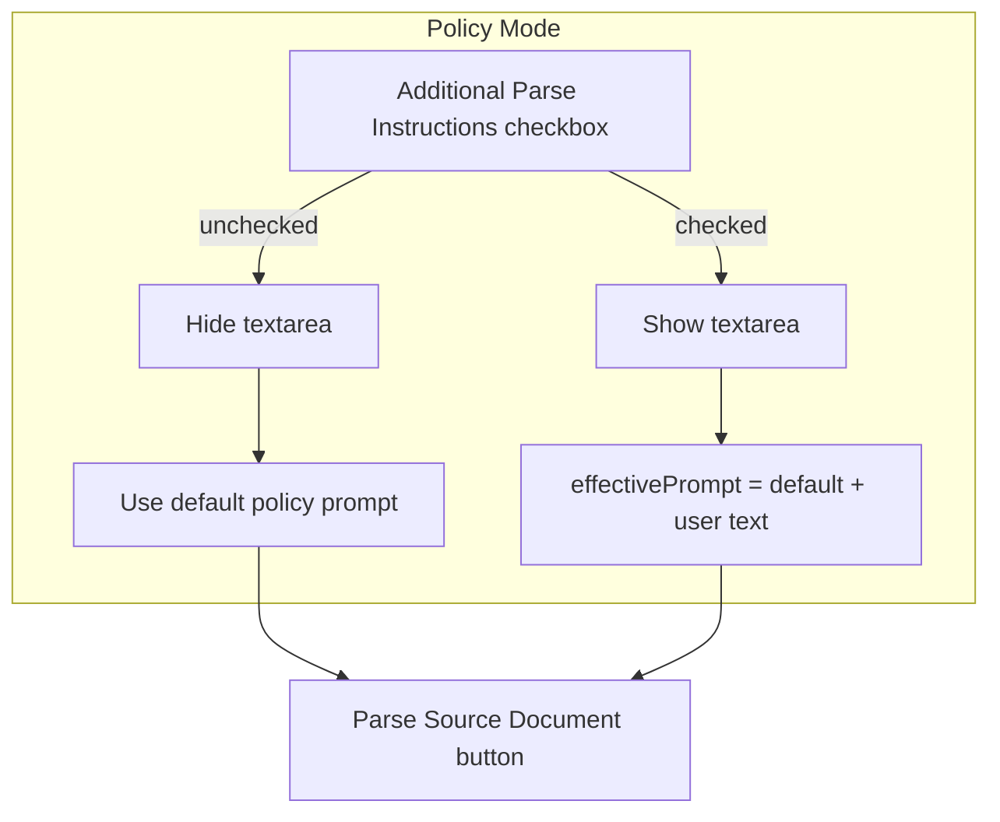

# Parse Modal UI Updates

## Summary

Modify [frontend/src/components/ParseModal.tsx](../frontend/src/components/ParseModal.tsx) to:

1. Rename the parse button to "Parse Source Document"
2. Use the default policy prompt as the default for policy mode
3. Hide the parse prompt textarea unless "Additional Parse Instructions" is checked
4. When the checkbox is checked, append user-entered text to the default prompt (not override)

## Current Behavior

- Parse prompt textarea and "Use default policy prompt" button are always visible for policies
- Primary button labeled "Prompt"
- For policies: empty prompt uses default; user can override by typing
- For statutes: user must enter a prompt (no default)

## Proposed Changes

### 1. Button Label

- Change primary button text from "Prompt" to **"Parse Source Document"**
- Change loading state from "Prompting…" to **"Parsing…"**

### 2. Add "Additional Parse Instructions" Checkbox

- Add state: `showAdditionalParseInstructions` (default: `false`)
- Add checkbox: `<input type="checkbox" />` with label "Additional Parse Instructions"
- Place checkbox in the parse panel, above where the textarea would appear

### 3. Conditional Parse Prompt Visibility

- **When checkbox is unchecked** (default):
  - Hide: parse prompt label, textarea, field hint, and "Use default policy prompt" button
  - Show: only the "Parse Source Document" button
  - For **policies**: use `policyParseConfig.parse_prompt` as the effective prompt
  - For **statutes**: keep current behavior—user must have a prompt. Since there is no statute default, the statute flow will need the checkbox to be checked (or we always show the prompt for statutes). **Recommendation**: For statutes, always show the parse prompt section (checkbox and conditional hiding apply only when `mode === "policy"`).

### 4. Append Logic When Checkbox Is Checked

- When "Additional Parse Instructions" is checked and user enters text:
  - **Policies**: `effectivePrompt = (policyParseConfig?.parse_prompt ?? "") + "\n\n" + parsePrompt.trim()`
  - **Statutes**: `effectivePrompt = parsePrompt.trim()` (no default to append to)
- When checkbox is checked but textarea is empty: use default only (policies) or require input (statutes)

### 5. Layout and Scope

**Statute mode**: Keep parse prompt always visible (no default prompt exists). Checkbox can be omitted for statutes, or shown but with different hint text.

## File Changes

| File | Changes |
|------|---------|
| [frontend/src/components/ParseModal.tsx](../frontend/src/components/ParseModal.tsx) | Add `showAdditionalParseInstructions` state; add checkbox; conditionally render textarea/hint/Use-default button; update `handleRunParse` effective prompt logic (append when checkbox checked); rename button to "Parse Source Document" |

## Edge Cases

- **Policy mode, checkbox unchecked**: Parse always uses default. Button enabled when `policyParseConfig?.parse_prompt` exists.
- **Policy mode, checkbox checked, empty textarea**: Use default only (same as unchecked).
- **Policy mode, checkbox checked, with text**: Append user text to default.
- **Statute mode**: No default; parse prompt section remains visible; user must enter a prompt. Checkbox can be hidden for statutes.
