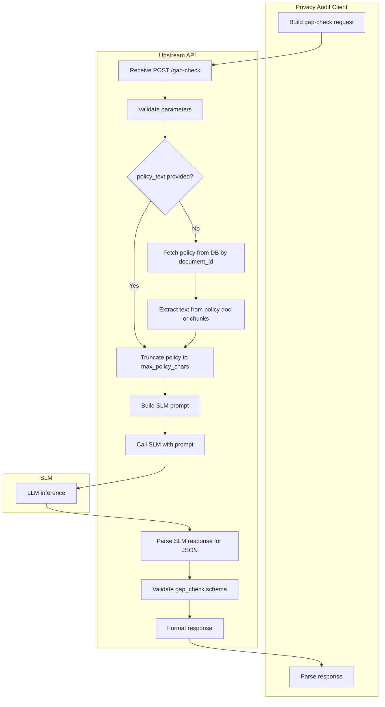

# Upstream Gap-Check API — Technical Specification

**Version:** 1.0  
**Status:** Draft for upstream implementation  
**Consumer:** Privacy Audit Studio — Compliance Gap Analysis Engine

---

## 1. Purpose and Context

### 1.1 Problem Statement

The Privacy Audit Studio uses the upstream **parse-llm** API for two distinct tasks:

| Task | Current Endpoint | Expected Behavior | Actual Behavior |
|------|------------------|-------------------|-----------------|
| **Document parsing** | `/parse-llm` | Parse policy/statute into chunks | Returns `parsed_doc` with chunks — works |
| **Gap analysis** | `/parse-llm` | Answer: "Does policy address statute requirement?" | Returns `parsed_doc` with policy text — fails |

For gap analysis, we send a prompt such as:

> "Consider the following statute requirement: [statute text]. Does the policy document address this requirement? Respond with only this JSON: {\"addressed\": true or false, \"policy_quote\": \"...\", \"missing\": true or false, \"conflict\": true or false, \"conflict_description\": \"...\"}."

The upstream treats this as a document-parse request: it fetches the policy by `document_id`, runs its parsing pipeline, and returns `parsed_doc` with policy text chunks. **The prompt is ignored.** We need an LLM to answer the question, not to re-parse the document.

### 1.2 Solution Overview

Add a dedicated **gap-check** capability to the upstream API that:

1. Accepts a statute requirement + policy document reference (or policy text)
2. Invokes the SLM with both as context
3. Returns a structured JSON answer (addressed, policy_quote, missing, conflict, conflict_description)

---

## 2. Implementation Options

### Option A: New Endpoint `/gap-check` (Recommended)

- **Path:** `POST /gap-check`
- **Pros:** Clear separation of concerns; no risk of breaking parse-llm; explicit contract
- **Cons:** New route to maintain

### Option B: Mode Parameter on `/parse-llm`

- **Path:** `POST /parse-llm` with `mode: "gap_check"`
- **Pros:** Single endpoint; reuse auth and infra
- **Cons:** Same endpoint does two different things; response shape differs by mode

This spec defines **Option A** in full. Option B can be derived by adding a `mode` discriminator and branching logic.

---

## 3. API Specification: `POST /gap-check`

### 3.1 Endpoint

```
POST {BASE_URL}/gap-check
Content-Type: application/json
```

### 3.2 Request Parameters

| Parameter | Type | Required | Description |
|-----------|------|----------|-------------|
| `database_name` | string | Yes* | Database name (e.g. `privacy-compliance`). Required when `policy_text` not provided. |
| `collection_name` | string | Yes* | Collection containing the policy document (e.g. `policies`). Required when `policy_text` not provided. |
| `document_id` | string | Yes* | ID of the policy document to fetch. Required when `policy_text` not provided; optional for logging when `policy_text` provided. |
| `statute_text` | string | Yes | The statute requirement text (max 4000 chars recommended) |
| `statute_reference` | string | No | Optional reference (e.g. document_id, section id) for logging |
| `policy_text` | string | No | **Alternative to document_id:** If provided, use this instead of fetching from DB. Use when client already has policy text. |
| `max_policy_chars` | integer | No | Max chars of policy to send to SLM (default: 8000). Truncation from start or end. |

**\*** Either `policy_text` (non-empty) or (`database_name`, `collection_name`, `document_id`) must be provided.

**Behavior:**

- If `policy_text` is provided and non-empty: use it directly; `document_id` and DB fetch are optional (for logging only).
- If `policy_text` is omitted or empty: fetch the policy document from `{database_name}.{collection_name}` by `document_id`, extract `text` from the document or concatenate from policy chunks.

### 3.3 Request Schema (JSON)

```json
{
  "database_name": "privacy-compliance",
  "collection_name": "policies",
  "document_id": "142bcbe4-f34b-4f60-8be3-79ed269375ab",
  "statute_text": "# 1798.100. General Duties of Businesses that Collect Personal Information\n\n(a) A business that controls the collection of a consumer's personal information shall, at or before the point of collection, inform consumers of the following:\n\n(1) The categories of personal information to be collected...",
  "statute_reference": "8df572eb-4898-4677-98bf-25e96a7701fa",
  "policy_text": null,
  "max_policy_chars": 8000
}
```

**With `policy_text` (client bypasses DB fetch):**

```json
{
  "database_name": "privacy-compliance",
  "collection_name": "policies",
  "document_id": "142bcbe4-f34b-4f60-8be3-79ed269375ab",
  "statute_text": "# 1798.105. Consumers' Right to Delete Personal Information\n\n(a) A consumer shall have the right to request that a business delete any personal information...",
  "policy_text": "Source: https://example.com/privacy.pdf\n\n# Privacy Policy\n\nWe collect information...",
  "max_policy_chars": 8000
}
```

### 3.4 Response Schema (JSON)

**Success (200):**

```json
{
  "gap_check": {
    "addressed": false,
    "policy_quote": null,
    "missing": true,
    "conflict": false,
    "conflict_description": null
  }
}
```

**Field definitions:**

| Field | Type | Required | Description |
|-------|------|----------|-------------|
| `addressed` | boolean | Yes | True if the policy explicitly addresses the statute requirement |
| `policy_quote` | string \| null | Yes | Exact phrase from the policy that addresses the requirement, or null if not addressed |
| `missing` | boolean | Yes | True if the policy does not address the requirement |
| `conflict` | boolean | Yes | True if the policy explicitly conflicts with the statute |
| `conflict_description` | string \| null | Yes | Description of the conflict, or null if no conflict |

**Alternative success (200) — wrapped for compatibility:**

```json
{
  "chunks": [
    {
      "parsed_text": "{\"addressed\": false, \"policy_quote\": null, \"missing\": true, \"conflict\": false, \"conflict_description\": null}"
    }
  ]
}
```

The privacy-audit client can parse either format. Prefer `gap_check` for clarity.

**Error (4xx/5xx):**

```json
{
  "error": "Human-readable error message"
}
```

---

## 4. Workflow Diagram



---

## 5. Detailed Processing Logic

### 5.1 Step 1: Validate Request

- Require `statute_text` (non-empty, max 4000 chars recommended).
- Require either `policy_text` (non-empty) or (`database_name`, `collection_name`, `document_id`) for DB fetch.
- If invalid, return `400` with `{"error": "statute_text is required"}` or similar.

### 5.2 Step 2: Resolve Policy Text

- **If `policy_text` provided:** Use it. Optionally truncate to `max_policy_chars` (default 8000).
- **Else:** Fetch document from `{database_name}.{collection_name}` by `document_id`.
  - If document not found: return `404` with `{"error": "Policy document not found"}`.
  - Extract text: prefer `document.text`; else concatenate `policy_chunks` for that `document_id` (chunk_text or chunk_header_text).

### 5.3 Step 3: Truncate Policy

- Truncate policy text to `max_policy_chars` (default 8000).
- Strategy: prefer keeping the end (e.g. truncate from start) so disclosure sections are retained; or use a sliding window. Document the strategy.

### 5.4 Step 4: Build SLM Prompt

Use the following prompt template (or equivalent):

```
Consider the following statute requirement:

{statute_text}

Below is a privacy policy document. Does the policy address this statute requirement? If yes, quote the exact policy phrase that addresses it. If there is a conflict with the statute, describe it.

PRIVACY POLICY:
{policy_text}

Respond with only a valid JSON object with these exact keys: addressed (boolean), policy_quote (string or null), missing (boolean), conflict (boolean), conflict_description (string or null). No other text.
```

### 5.5 Step 5: Invoke SLM

- Call the SLM (e.g. fine-tuned US privacy law model) with the prompt.
- Use temperature 0 or low for deterministic output.
- Set max tokens sufficient for a JSON object (~200–500).

### 5.6 Step 6: Parse and Validate SLM Response

- Extract JSON from the raw response (handle markdown code blocks, trailing text).
- Validate: `addressed`, `missing`, `conflict` are booleans; `policy_quote`, `conflict_description` are string or null.
- If parsing fails: retry once with a stricter prompt ("Respond with ONLY a valid JSON object..."). If still failing, return `500` with `{"error": "LLM parsing failed"}`.

### 5.7 Step 7: Return Response

- Return `200` with `{"gap_check": { ... }}` or `{"chunks": [{"parsed_text": "..."}]}`. See Section 3.4.

---

## 6. Error Handling

| HTTP Status | Condition | Response Body |
|-------------|-----------|---------------|
| 400 | Missing required parameter | `{"error": "statute_text is required"}` |
| 400 | Missing policy source (no policy_text and no document_id) | `{"error": "Either policy_text or (database_name, collection_name, document_id) is required"}` |
| 404 | Policy document not found in DB | `{"error": "Policy document not found"}` |
| 500 | SLM invocation failed | `{"error": "LLM parsing failed"}` |
| 500 | SLM returned invalid JSON after retry | `{"error": "Could not parse SLM response"}` |
| 502 | Upstream service unavailable | `{"error": "Service unavailable"}` |

---

## 7. SLM Prompt Engineering

### 7.1 Recommended Prompt

```
Consider the following statute requirement:

{statute_text}

Below is a privacy policy document. Does the policy address this statute requirement? If yes, quote the exact policy phrase that addresses it. If there is a conflict with the statute, describe it.

PRIVACY POLICY:
{policy_text}

Respond with only a valid JSON object. Use these exact keys: addressed, policy_quote, missing, conflict, conflict_description. addressed, missing, and conflict must be booleans. policy_quote and conflict_description must be strings or null if not applicable.
```

### 7.2 Retry Prompt (on parse failure)

```
{original_prompt}

IMPORTANT: Respond with ONLY a valid JSON object, no other text. Use the exact keys: addressed, policy_quote, missing, conflict, conflict_description.
```

### 7.3 Output Constraints

- Prefer `missing: true` over `addressed: true` when ambiguous.
- `policy_quote` must be a substring of the actual policy text (client will verify).
- `conflict_description` should be concise (1–2 sentences).

---

## 8. Client Integration (Privacy Audit Studio)

### 8.1 Current Call (parse-llm — fails for gap check)

```python
response, error = forward_post("/parse-llm", {
    "database": database_name,
    "collection": policy_collection,
    "document_id": policy_document_id,
    "parse_prompt": prompt,  # statute + question
    "prompt": prompt,
})
```

### 8.2 New Call (gap-check)

```python
response, error = forward_post("/gap-check", {
    "database_name": database_name,
    "collection_name": policy_collection,
    "document_id": policy_document_id,
    "statute_text": statute_text,
    "statute_reference": statute_chunk.get("document_id"),
    "policy_text": policy_text,  # optional; client already has it
    "max_policy_chars": 8000,
})
```

### 8.3 Client Response Handling

- If `response.get("gap_check")`: use it directly.
- Else if `response.get("chunks")` and `parsed_text` contains JSON: parse and use.
- Else: treat as `analysis_failed`.

---

## 9. Backward Compatibility

- **New endpoint:** No impact on existing `/parse-llm` behavior.
- **parse-llm** continues to return `parsed_doc` for document parsing.
- **gap-check** is additive; clients can migrate when upstream is ready.

---

## 10. Example Requests and Responses

### 10.1 Example Request

```json
{
  "database_name": "privacy-compliance",
  "collection_name": "policies",
  "document_id": "142bcbe4-f34b-4f60-8be3-79ed269375ab",
  "statute_text": "# 1798.105. Consumers' Right to Delete Personal Information\n\n(a) A consumer shall have the right to request that a business delete any personal information about the consumer which the business has collected from the consumer.",
  "statute_reference": "8df572eb-4898-4677-98bf-25e96a7701fa",
  "max_policy_chars": 8000
}
```

### 10.2 Example Success Response

```json
{
  "gap_check": {
    "addressed": true,
    "policy_quote": "Delete your personal information. You may request that Lowe's delete your personal information we maintain about you.",
    "missing": false,
    "conflict": false,
    "conflict_description": null
  }
}
```

### 10.3 Example Missing Response

```json
{
  "gap_check": {
    "addressed": false,
    "policy_quote": null,
    "missing": true,
    "conflict": false,
    "conflict_description": null
  }
}
```

### 10.4 Example Conflict Response

```json
{
  "gap_check": {
    "addressed": false,
    "policy_quote": null,
    "missing": false,
    "conflict": true,
    "conflict_description": "The policy states that personal information is never shared, but the statute requires disclosure of sharing in certain circumstances."
  }
}
```

---

## 11. Appendix: Mode Parameter on parse-llm (Option B)

If implementing via Option B, add to `/parse-llm`:

| Parameter | Type | Required | Description |
|-----------|------|----------|-------------|
| `mode` | string | No | `"parse"` (default) or `"gap_check"` |

When `mode: "gap_check"`:

- Require `statute_text` in the request (or in `prompt`).
- Require `document_id` or `policy_text`.
- Run the gap-check workflow (Section 5) instead of document parsing.
- Return `{"gap_check": {...}}` instead of `{"parsed_doc": [...]}`.

---

## 12. Upstream OpenAPI Compatibility Analysis

The upstream Web Gather API exposes `POST /gap-check` with the following schema. This section compares it to our requirements and identifies any gaps.

### 12.1 Upstream Request Schema (GapCheckRequest)

| Parameter | Type | Required | Description |
|-----------|------|----------|-------------|
| `policy_database_name` | string | Yes | Database containing the policy |
| `policy_collection_name` | string | Yes | Collection (e.g. `policies`) |
| `policy_document_id` | string | Yes | Policy document ID |
| `statute_database_name` | string | Yes | Database containing the statute |
| `statute_collection_name` | string | Yes | Collection (e.g. `statutes` or `statute_chunks`) |
| `statute_document_id` | string | Yes | Statute requirement document ID |
| `max_policy_chars` | integer | No | Default 8000 |

### 12.2 Upstream Response Schema (GapCheckResponse)

```json
{
  "gap_check": {
    "addressed": boolean,
    "policy_quote": string | null,
    "missing": boolean,
    "conflict": boolean,
    "conflict_description": string | null
  }
}
```

**Verdict: Response schema matches our needs exactly.**

### 12.3 Compatibility Assessment

| Requirement | Upstream Support | Notes |
|-------------|------------------|-------|
| Policy by document ID | Yes | `policy_document_id` + `policy_collection_name` + `policy_database_name` |
| Statute requirement text | Partial | Upstream fetches by `statute_document_id`; we have statute **chunks** |
| Response format | Yes | `gap_check` object matches |
| max_policy_chars | Yes | Default 8000 |

### 12.4 Statute Chunk vs Statute Document

Our gap analysis iterates over **statute chunks** (one requirement per chunk), not full statute documents:

- **Our data**: Chunks from `statute_chunks` collection; each chunk has `_id`, `document_id` (parent), `chunk_text`, `chunk_header_text`
- **Upstream design**: Fetches a document by `statute_document_id` from `statute_collection_name`

**Two ways to align:**

1. **Use statute chunks as documents**  
   Pass `statute_document_id: chunk["_id"]` and `statute_collection_name: "statute_chunks"`. The upstream must extract the statute requirement from `chunk_text` (or `chunk_header_text` + `chunk_text`). The upstream implementation must support this document shape.

2. **Add `statute_text` (optional)**  
   If the upstream adds an optional `statute_text` parameter, we can pass the chunk text directly and bypass the statute fetch. This avoids any ambiguity about chunk vs full-document schema.

### 12.5 Client Integration Changes Required

To use the upstream `/gap-check` endpoint, the Privacy Audit engine must:

1. **Replace `_parse_llm` with `_gap_check`** for gap analysis: call `forward_post("/gap-check", {...})` instead of `forward_post("/parse-llm", {...})`.

2. **Map parameters**:
   - `policy_database_name` = `database_name`
   - `policy_collection_name` = `policy_collection` (e.g. `policies`)
   - `policy_document_id` = `policy_document_id`
   - `statute_database_name` = `database_name`
   - `statute_collection_name` = `statute_chunk_collection` (e.g. `statute_chunks`)
   - `statute_document_id` = `statute_chunk.get("_id")` — **requires each chunk to have `_id`**

3. **Ensure statute chunks have `_id`**: When fetching chunks via `_get_documents` or vector-search, the returned documents must include MongoDB `_id`. If chunks are returned without `_id`, we cannot use the document-ID path and would need `statute_text` support.

### 12.6 Recommendation

**The upstream schema is sufficient to proceed** if:

- The upstream implementation fetches from `statute_chunks` when `statute_collection_name: "statute_chunks"` and uses `chunk_text` (or `chunk_header_text` + `chunk_text`) as the statute requirement.
- Our statute chunks include `_id` when returned from the documents/vector-search APIs.

**Optional enhancement**: Add `statute_text` (and optionally `policy_text`) to the upstream request so the client can pass text directly when it already has it, avoiding extra DB fetches and schema assumptions.

---

## 13. Revision History

| Version | Date | Changes |
|---------|------|---------|
| 1.0 | 2026-02-13 | Initial spec |
| 1.1 | 2026-02-13 | Added Section 12: Upstream OpenAPI compatibility analysis |
