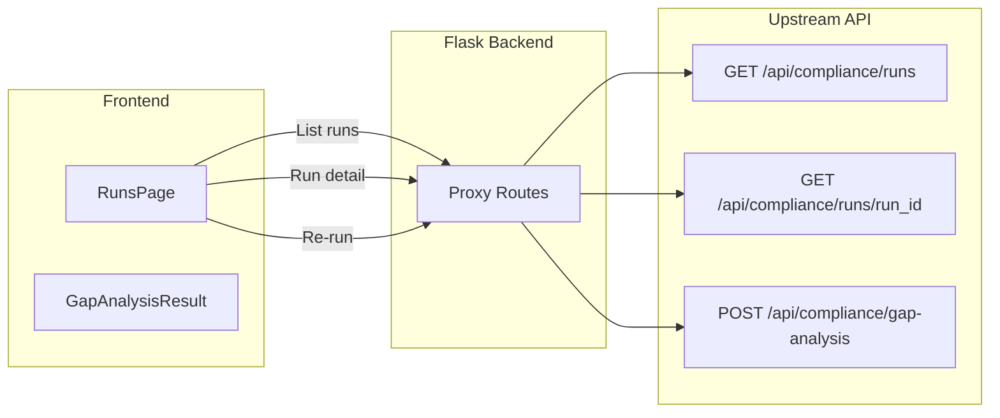

# Plan: View and Manage Compliance Runs and Jobs

## Current State

- **Runs list**: `GET /api/compliance/runs` (proxied) returns `RunsListResponse` with `runs[]` of `RunSummaryItem` (run_id, policy_document_id, company_name, run_at, privacy_health_score, summary, types).
- **Run detail**: `GET /api/compliance/runs/{run_id}` (proxied) returns full payload. The user-provided "jobs endpoint result" shows this can be job-shaped: `job_id`, `job_type`, `status`, `created_at`, `completed_at`, `request`, `result` (with gaps, summary, etc.).
- **RunsPage** ([frontend/src/pages/RunsPage.tsx](frontend/src/pages/RunsPage.tsx)) already lists runs, fetches detail on selection, shows gap analysis or raw JSON, and supports download JSON/report.
- **Data flow**: All compliance data is proxied to the upstream API; no local MongoDB for runs. Gap analysis results are written to `compliance_results` via upstream `write_to_collection`.

## Architecture

## Implementation Plan

### 1. TypeScript Types for Jobs and Run Detail

**File**: [frontend/src/types/api.ts](frontend/src/types/api.ts)

- Add `ComplianceJob` (or `RunDetail`) interface for job-shaped run detail:
  - `job_id`, `job_type`, `status`, `created_at`, `completed_at`, `error`
  - `request`: `{ policy_document_id, applicable_jurisdictions, ... }`
  - `result`: `GapAnalysisResponse`-like (gaps, summary, company_name, etc.)
- Extend `RunSummaryItem` to optionally include `job_id`, `status`, `job_type`, `created_at`, `completed_at` if the upstream list returns them.
- Add helper: `toGapAnalysisResponse(detail)` that extracts `result` from job-shaped detail or returns detail as-is for flat gap responses.

### 2. RunsPage: Handle Job-Shaped Detail

**File**: [frontend/src/pages/RunsPage.tsx](frontend/src/pages/RunsPage.tsx)

- **ID resolution**: Use `run_id || job_id` for selection and API calls (run detail may return `job_id`).
- **Gap extraction**: When detail is job-shaped (`result.gaps`), pass `detail.result` to `GapAnalysisResult`; otherwise use detail directly (current behavior).
- **Meta strip**: Show job_type, status, created_at, completed_at when available.
- **Policy ID for report**: Use `detail.request?.policy_document_id ?? detail.policy_document_id` for report download.

### 3. Management Actions

**Re-run** (always feasible):

- Add "Re-run" button in the detail header.
- On click: call `POST /api/compliance/gap-analysis` with `policy_document_id` and `applicable_jurisdictions` from `detail.request` (or `detail`).
- Show loading state; on success, optionally refetch runs list and/or show success message. User can then select the new run from the list.

**Delete** (conditional):

- The upstream OpenAPI does not expose `DELETE /api/compliance/runs/{id}` or `DELETE /api/compliance/jobs/{id}`.
- **Option A**: Add backend proxy `DELETE /api/compliance/runs/<run_id>` that forwards to upstream if/when the upstream adds the endpoint.
- **Option B**: If the upstream stores runs in a MongoDB collection accessible via `/documents` (delete by query), add a backend route that calls `forward_delete("/documents", { query: { run_id } })` for the relevant collection. This depends on upstream schema.
- **Recommendation**: Implement a "Delete" button that calls a new backend route. The backend attempts `forward_delete` to an upstream delete endpoint if available; otherwise return 501 "Delete not supported" and hide or disable the button when unsupported. Document the dependency on upstream support.

### 4. List View Enhancements

**File**: [frontend/src/pages/RunsPage.tsx](frontend/src/pages/RunsPage.tsx)

- Show `status` badge (pending, running, completed, failed) in the table when `run.status` or `run.job_status` is present.
- Show `job_type` or `types` (e.g. "gap_analysis", "gap") when available.
- Use `created_at` or `run_at` for date display; prefer `completed_at` for completed jobs.
- Ensure row key uses `run_id || job_id || policy_document_id` for stability.

### 5. Backend: Re-run and Delete Proxies

**File**: [backend/app.py](backend/app.py)

- **Re-run**: No new route needed. The frontend calls existing `POST /api/compliance/gap-analysis` with params from the selected run.
- **Delete**: Add `@app.route("/api/compliance/runs/<run_id>", methods=["DELETE"])` that:
  - Proxies to `forward_delete(f"/api/compliance/runs/{run_id}", {})` or equivalent upstream DELETE if it exists.
  - If upstream returns 404/501, return appropriate error. Document that delete requires upstream support.

### 6. UI Polish

- Add "Re-run" as a ghost button next to "Download JSON" and "Download report".
- Add status badge styles for pending, running, completed, failed (reuse or extend existing `.status-badge` in [frontend/src/styles.css](frontend/src/styles.css)).
- Optional: Add a "Refresh" button to refetch the runs list without changing filters.

## Data Shape Mapping

| Upstream List (RunSummaryItem) | Job Detail (user example)  |
| ------------------------------ | -------------------------- |
| run_id                         | job_id                     |
| run_at                         | completed_at or created_at |
| policy_document_id             | request.policy_document_id |
| company_name                   | result.company_name        |
| summary                        | result.summary             |
| types                          | job_type                   |
| (none)                         | status                     |

## Out of Scope / Future

- Separate "Jobs" page vs "Runs" page: treat as same concept; one page with filters.
- Real-time job status polling for running jobs.
- Bulk delete or bulk re-run.

## Verification

- Runs list loads and displays runs with status/type when available.
- Selecting a run loads job-shaped detail; gap analysis view renders correctly.
- Re-run triggers gap analysis and shows feedback.
- Delete works when upstream supports it; graceful handling when not.
- Download JSON and report work for both flat and job-shaped detail.
