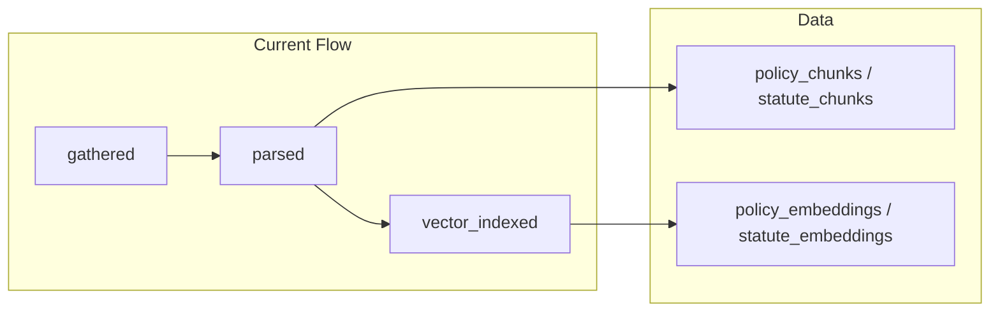
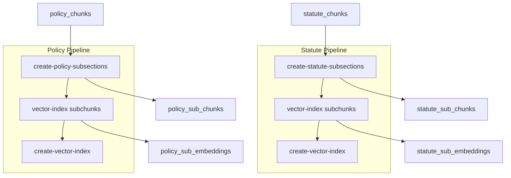

# Subsections and Sub-Embeddings Workflow Enhancement

## Current State



- **ParseModal** ([frontend/src/components/ParseModal.tsx](frontend/src/components/ParseModal.tsx)): User saves chunks via `/api/save-parsed`, then manually clicks "Vector Index" which calls `/api/vector-index` with `policy_chunks`/`statute_chunks` as source.
- **vector-index** ([backend/app.py](backend/app.py) L546-624): Proxies to upstream; does not pass `text_column`.
- **Workflow** ([backend/workflow.py](backend/workflow.py)): Steps are `gathered`, `parsed`, `vector_indexed`.

## Target Architecture



## Implementation Plan

### 1. Backend: Add Upstream Proxies

**File**: [backend/app.py](backend/app.py)

Add three new proxy routes that forward to upstream:

| Route | Upstream | Purpose |
|-------|----------|---------|
| `POST /api/create-statute-subsections` | `/create-statute-subsections` | Create statute_sub_chunks from statute_chunks |
| `POST /api/create-policy-subsections` | `/create-policy-subsections` | Create policy_sub_chunks from policy_chunks |
| `POST /api/create-vector-index` | `/create-vector-index` | Create Atlas/vector index on embeddings collection |

**create-statute-subsections** payload (from user spec):
```json
{
  "column": "chunk_text",
  "database": "privacy-compliance",
  "destination_collection": "statute_sub_chunks",
  "parse_prompt": null,
  "source_collection": "statute_chunks",
  "source_query": {"document_id": "<document_id>"},
  "subsection_column": "subchunk_text"
}
```

**create-policy-subsections** payload:
```json
{
  "column": "chunk_text",
  "database": "privacy-compliance",
  "destination_collection": "policy_sub_chunks",
  "parse_prompt": null,
  "source_collection": "policy_chunks",
  "source_query": {"document_id": "<document_id>"},
  "subsection_column": "subchunk_text"
}
```

**create-vector-index** payload (statutes):
```json
{
  "collection_name": "statute_sub_embeddings",
  "database_name": "privacy-compliance",
  "filter_fields": ["jurisdiction", "document_id"],
  "index_name": "vector_index"
}
```

**create-vector-index** payload (policies): use `filter_fields: ["document_id"]` (policies lack jurisdiction).

### 2. Extend vector-index Proxy for text_column

**File**: [backend/app.py](backend/app.py) (vector_index route, ~L569)

Add passthrough for `text_column` so subchunk indexing can use `subchunk_text`:

```python
if payload.get("text_column"):
    proxy_payload["text_column"] = str(payload["text_column"])
```

### 3. Orchestration: Run Subsection Pipeline After Save-Parsed

**File**: [backend/app.py](backend/app.py)

Add a helper `_run_subsection_pipeline(document_id, document_type, database_name)` that:

1. Calls `create-statute-subsections` or `create-policy-subsections` with `source_query: {"document_id": document_id}`
2. Calls `vector-index` with:
   - source: `statute_sub_chunks` / `policy_sub_chunks`
   - index: `statute_sub_embeddings` / `policy_sub_embeddings`
   - `source_query`: `{"document_id": document_id}`
   - `text_column`: `"subchunk_text"`
3. Calls `create-vector-index` on the embeddings collection (idempotent; may need to handle "index exists" errors)

Invoke this helper at the end of `save_parsed_document()` after chunks are saved and `parsed` step is upserted. Run the pipeline synchronously; on success, upsert `vector_indexed` step.

**Error handling**: If any step fails, return error to client; do not mark `vector_indexed`. The `parsed` step remains completed.

### 4. Update Compliance Config for Sub-Embeddings

**File**: [backend/compliance_config.json](backend/compliance_config.json)

Add or update config keys so compliance uses sub-embeddings:

- `index_collection_name`: `"statute_sub_embeddings"` (or keep `statute_embeddings` for backward compat and add `statute_sub_index_collection`)
- `policy_index_collection_name`: `"policy_sub_embeddings"`

**Decision**: Replace existing collections so compliance uses subchunks. Existing `statute_embeddings`/`policy_embeddings` will no longer be populated by the new flow.

### 5. Frontend: Remove Manual Vector Index (Optional)

**File**: [frontend/src/components/ParseModal.tsx](frontend/src/components/ParseModal.tsx)

Since the pipeline runs automatically after save-parsed:

- **Option A**: Remove the "Vector Index" button; saving parsed chunks triggers the full pipeline.
- **Option B**: Keep the button as "Re-index" for re-running the pipeline if needed.

Recommend **Option A** for simplicity; the pipeline runs automatically. If re-index is needed, user can re-save (after clearing chunks) or we add a "Re-index" action later.

### 6. Workflow and Backfill

**File**: [backend/workflow.py](backend/workflow.py)

No change to `WORKFLOW_STEPS`. The `vector_indexed` step is set when the subsection pipeline completes successfully.

**Backfill** ([backend/app.py](backend/app.py) `workflow_backfill`): The backfill uses `policy_index_collection_name` and `index_collection_name` to check if documents are indexed. Update to use `statute_sub_embeddings` and `policy_sub_embeddings` when checking vector_indexed status. The backfill will need to run the subsection pipeline for documents that have chunks but no sub-embeddings, or we document that backfill does not auto-run the new pipeline (manual re-process required).

### 7. Collection Names (Constants)

**File**: [backend/app.py](backend/app.py)

Add constants:
- `STATUTE_SUB_CHUNK_COLLECTION = "statute_sub_chunks"`
- `POLICY_SUB_CHUNK_COLLECTION = "policy_sub_chunks"`
- `STATUTE_SUB_EMBEDDINGS_COLLECTION = "statute_sub_embeddings"`
- `POLICY_SUB_EMBEDDINGS_COLLECTION = "policy_sub_embeddings"`

### 8. Tests

- Add tests for new proxy routes (`test_create_statute_subsections`, `test_create_policy_subsections`, `test_create_vector_index`).
- Add test for `save_parsed_document` that mocks the subsection pipeline and verifies `vector_indexed` is set on success.
- Add test for `vector_index` with `text_column` passthrough.
- Update `test_vector_index.py` if needed.

## Data Flow Summary

| Step | Statutes | Policies |
|------|-----------|----------|
| 1 | `/create-statute-subsections` | `/create-policy-subsections` |
| 2 | `/vector-index` (statute_sub_chunks → statute_sub_embeddings, text_column: subchunk_text) | `/vector-index` (policy_sub_chunks → policy_sub_embeddings, text_column: subchunk_text) |
| 3 | `/create-vector-index` (statute_sub_embeddings, filter: jurisdiction, document_id) | `/create-vector-index` (policy_sub_embeddings, filter: document_id) |

## Open Questions

1. **create-vector-index idempotency**: If the index already exists, does the upstream return success or error? Plan assumes we call it; if it fails with "exists", we could treat as success.
2. **Policy filter_fields**: User spec did not include create-vector-index for policies. Plan includes it with `filter_fields: ["document_id"]` for consistency.
3. **Async vs sync**: Running the full pipeline in save-parsed may increase response time. If upstream calls are slow, consider a background task or separate "Process" endpoint that the frontend calls after save.
